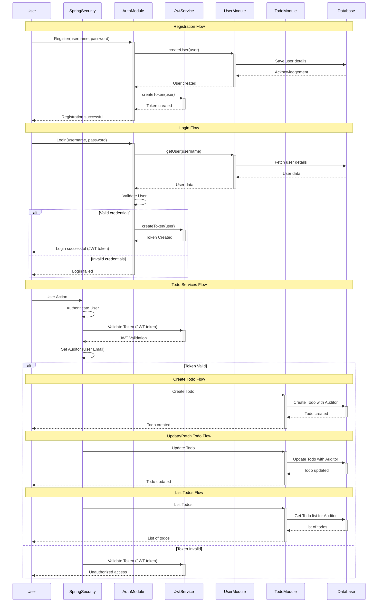

# justodoit
## just todo it, schedule for later on

# technologies

- java 21
- spring boot 3.4.4
- couchbase 7.6.3
- prometheus v2.44.0 (for observability)
- grafana v9.5.2 (for observability)

# architecture

## folder structure
the project structured for modularity. there is 3 base folders; domain, exception and security

security module contains security configurations and filters. it is responsible for authentication and authorization mainly.

exception module contains custom exceptions and exception handlers.

domain contains 3 submodules; todo, user and auth.
- auth module is responsible for authentication and authorization.
- user module is an internal module, not exposed to the outside world. it is used mainly for authentication and authorization by auth module.
- todo module is responsible for todo operations. it is the main module of the project.

## project architecture (sequence diagram)



# how to run

## for development

### prerequisites

- docker
- maven
- java 21

### steps

- first run the docker compose file contains couchbase, prometheus and grafana
- then run the spring boot application

```shell
cd docker
docker compose up -d # run the docker compose file
```

```shell
./mvnw spring-boot:run # run the spring boot application
```

## for production

you can use the docker compose file in the docker folder to run the application in production mode.

!!! CAUTION !!! do not forget to change values in the docker-compose file before running it in production.
